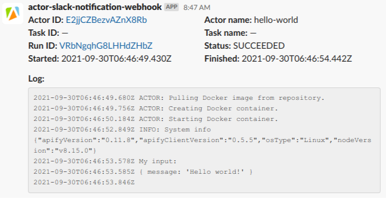

# Slack notification actor

This actor is supposed to be run via webhooks to send Slack notifications
about other actor/task's events.

## Slack setup

This actor uses [Incoming Webhooks](https://api.slack.com/messaging/webhooks)
for sending the messages. Refer to
[this article](https://slack.com/intl/en-cz/help/articles/115005265063-Incoming-webhooks-for-Slack)
for the setup process.

## Using the actor

To start getting notifications for an actor (or task) create a new webhook
for that actor (or task). As a webhook URL, use:

    https://api.apify.com/v2/acts/tlinhart~slack-notification-webhook/runs?token=<APIFY_TOKEN>

where `APIFY_TOKEN` is your Apify API token. You can find the token on the
[Integrations](https://console.apify.com/account#/integrations) page in the Apify
console. You can also add other parameters supported by the
[Run actor](https://docs.apify.com/api/v2#/reference/actors/run-collection/run-actor)
endpoint to the URL, such as `timeout` and `memory`. Select events for which you
would like to receive notifications. Update the default webhook payload template
with `slackWebhookUrl` and optionally `slackWebhookArguments` to override
the defaults:

    {
        "slackWebhookUrl": "https://hooks.slack.com/services/TXXXXX/BXXXXX/XXXXX",
        "slackWebhookArguments": { ... },
        "userId": {{userId}},
        "createdAt": {{createdAt}},
        "eventType": {{eventType}},
        "eventData": {{eventData}},
        "resource": {{resource}}
    }

The `slackWebhookArguments` parameter supports most of the arguments supported
by the [Node Slack SDK](https://slack.dev/node-slack-sdk/), namely:

- `channel`
- `username`
- `iconEmoji`
- `iconUrl`
- `text`
- `blocks`
- `attachments`
- `linkNames`
- `unfurlLinks`
- `unfurlMedia`

To make the message format more flexible and customizable, all the string values
support JavaScript-like string interpolation. The variables that are available
for interpolation are those provided by the Apify platform in the default payload
template and also variables provided by this actor:

- `actor` – object returned by the [Get actor](https://docs.apify.com/api/v2#/reference/actors/actor-object/get-actor) endpoint
- `task` – object returned by the [Get task](https://docs.apify.com/api/v2#/reference/actor-tasks/task-object/get-task) endpoint
- `runLog` – actor run log returned by the [Get log](https://docs.apify.com/api/v2#/reference/logs/log/get-log) endpoint

By default, the message contains information about the actor (and the task
if available) and its run together with the last 15 lines of the run log.

